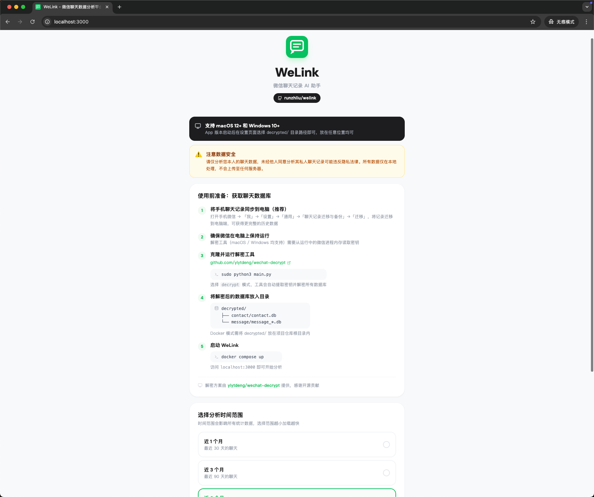
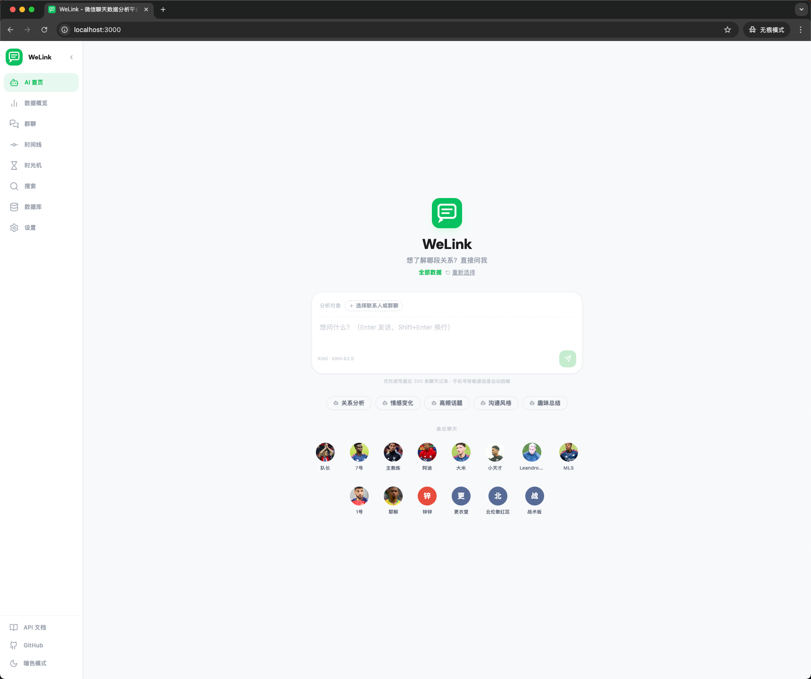
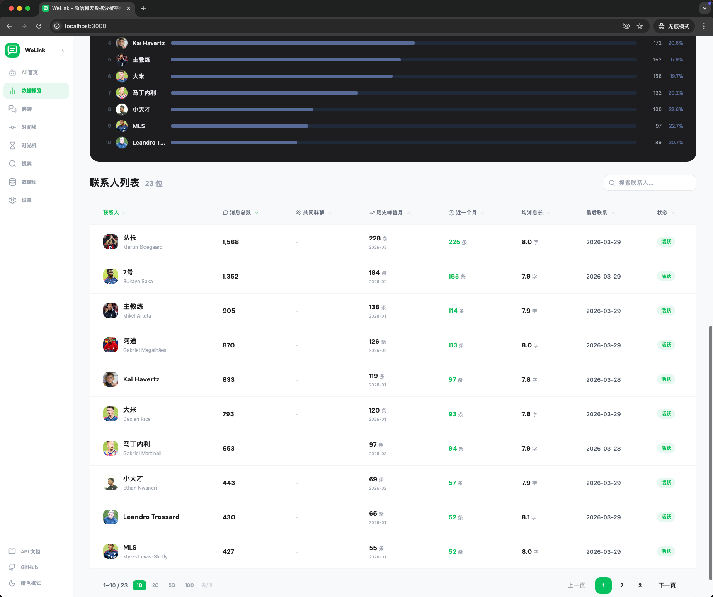
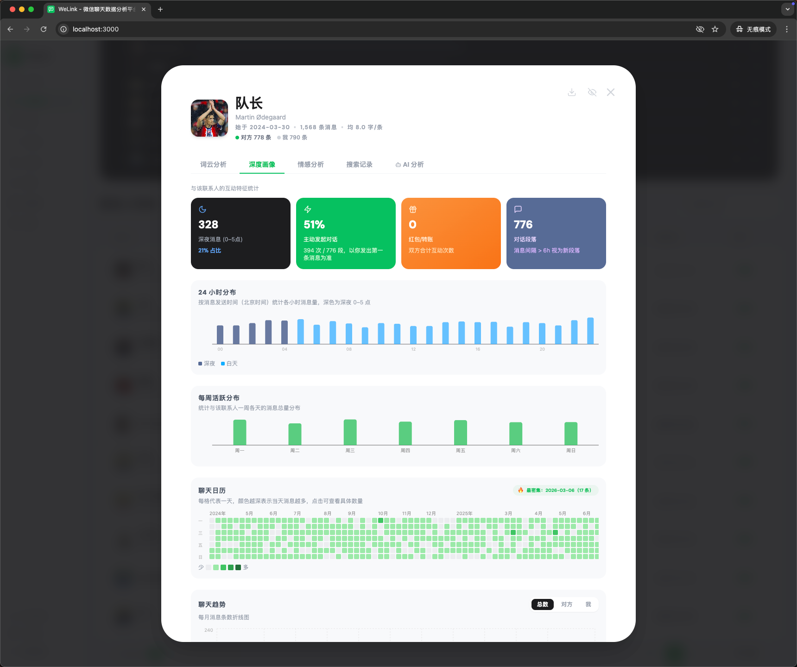
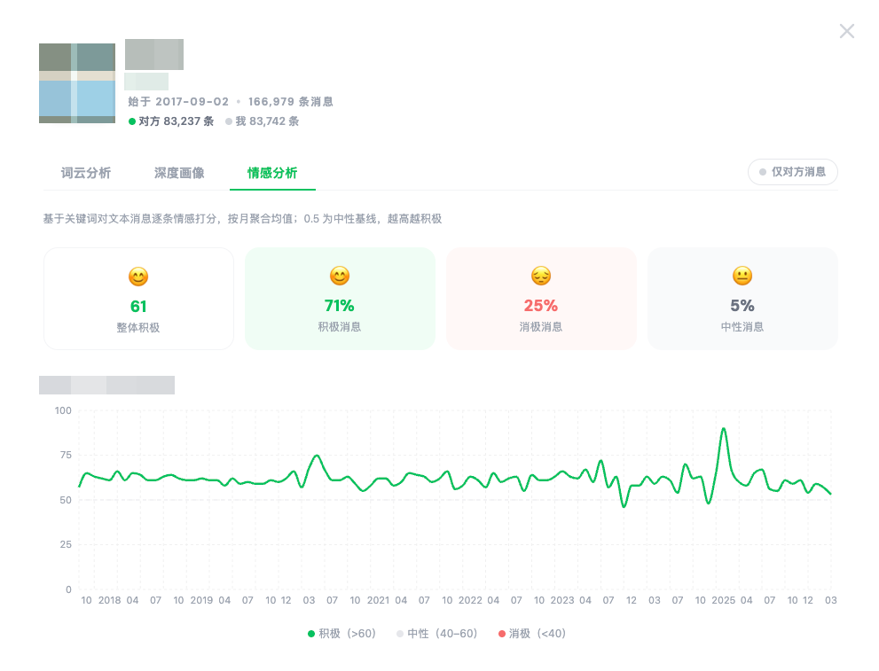
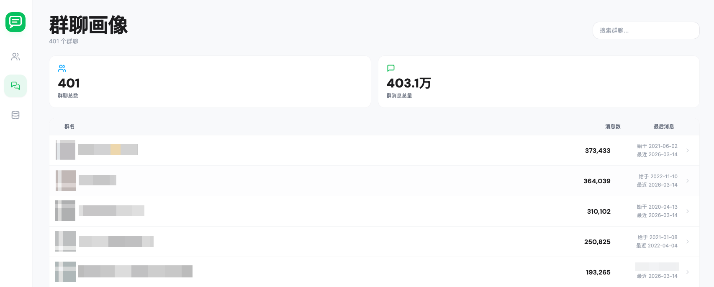
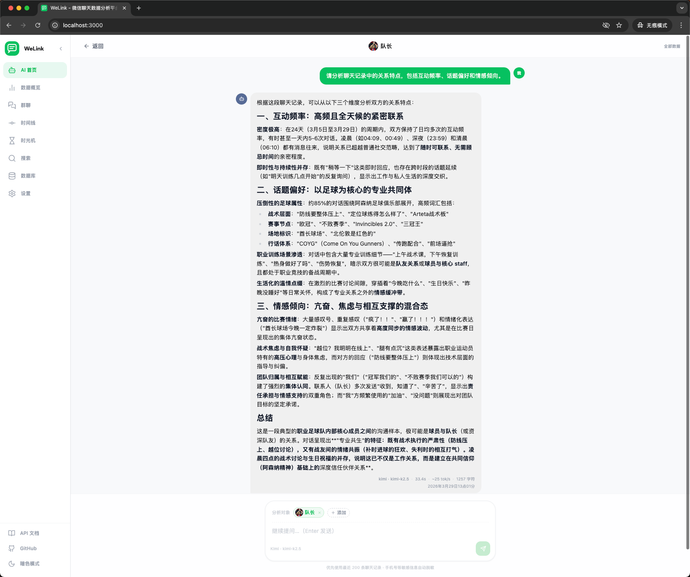

<p align="center">
  
</p>

<h1 align="center">WeLink — 微信聊天数据分析平台</h1>

<p align="center">
  <a href="https://github.com/runzhliu/welink/actions/workflows/docker-publish.yml">
    
  </a>
  <a href="https://github.com/runzhliu/welink/pkgs/container/welink%2Fbackend">
    
  </a>
  <a href="https://github.com/runzhliu/welink/pkgs/container/welink%2Ffrontend">
    
  </a>
  <a href="LICENSE">
    
  </a>
  <a href="https://github.com/runzhliu/welink/stargazers">
    
  </a>
  
  
  
  <br/><br/>
  <a href="https://welink.click"><strong>官方文档</strong></a> &nbsp;·&nbsp;
  <a href="https://demo.welink.click"><strong>在线 Demo</strong></a>
</p>

<https://github.com/user-attachments/assets/6964e121-c2a0-4595-8cb5-2f65dfa49420>

微信聊天记录里隐藏着你和每个人关系的完整轨迹：

- 第一条消息是哪天发的
- 哪段时期聊得最密集
- 凌晨还在聊天的都是什么人
- 最常说的词是什么
- ...

这些数据一直都在，只是没有一个地方能让你好好看清楚，而 **WeLink** 就是为这件事而做的。

## 功能

**好友分析**
- 消息总量排行，一眼看出谁是你真正常联系的人
- 历史峰值月消息数 + 近一个月消息数，直接在列表显示关系热度变化
- 均消息长度（字/条），反映与不同人的聊天风格差异
- 撤回消息次数，在联系人详情中呈现
- 第一条消息时间，回顾一段关系的起点
- 聊天趋势折线图：月度消息量可按「对方 / 我 / 总数」切换查看
- 24 小时活跃分布，发现你们的聊天习惯
- 聊天日历热力图，哪段时间最密集一目了然
- 词云分析，看看你们之间出现最多的词是什么
- 情感分析：按月统计聊天情绪曲线，支持「仅对方 / 双方」切换
- 深夜消息统计、红包次数、发起对话比例等社交特征
- 共同群聊数：联系人列表直接显示与该联系人的共同群聊数量，详情页可查看完整群聊列表并跳转

**认识时间线**
- 将所有联系人按第一条消息时间排列成时间轴，按年份分组
- 一眼看出每一年认识了哪些人，以及这些关系现在的热度状态

**全局搜索**
- 跨所有联系人一键搜索聊天记录，结果按联系人分组展示
- 关键词高亮，点击可直接跳转该联系人详情

**群聊分析**
- 群内发言排行
- 群活跃时间分布
- 群内高频词

**全局统计**
- 关系热度分布五档：活跃 / 温热 / 渐冷 / 沉寂 / 零消息，每档展示头像堆叠
- 总消息量、活跃好友数、零互动好友数
- 月度消息趋势（私聊 + 群聊可切换）
- 24 小时活跃分布（私聊 + 群聊可切换）
- 深夜聊天排行榜

**时间范围筛选**
- 支持选择近 1 个月 / 3 个月 / 6 个月 / 1 年 / 全部数据进行分析
- 支持自定义任意起止日期，精确分析某段时期的聊天数据

**隐私屏蔽**
- 侧边栏「屏蔽」页面，可按微信ID、昵称或备注名屏蔽指定联系人和群聊
- 被屏蔽的对象从好友列表、群聊列表中完全隐藏，数据仍保留在数据库中
- 屏蔽规则存储在浏览器本地（localStorage），不上传、不修改后端数据

## 🤖 MCP — 用自然语言查询你的微信数据

WeLink 内置了一个 [MCP（Model Context Protocol）](https://modelcontextprotocol.io/) 服务器，让你在 **Claude Code（CLI）** 里直接用中文提问来分析微信数据——无需打开浏览器，无需手动查找。

**几个例子：**

> 「我今年和哪个朋友聊得最多？」
>
> 「帮我分析一下我和 XXX 的关系深度，我们经常聊什么话题？」
>
> 「我哪个群最活跃？群里谁发言最多？」
>
> 「我凌晨还在聊天的都是什么人？」

AI 会自动调用 WeLink 后端，把分析结果直接呈现在对话里。

完整配置说明（注册 MCP Server + Skills 配置）见 [mcp-server/README.md](mcp-server/README.md)。


## 功能截图

### 快速入门引导

首次使用向导，一步步完成数据库解密、目录配置与分析时间范围选择。



### 好友总览 Dashboard

总好友数、总消息量、活跃好友、零消息好友一览，关系热度分布（活跃 / 温热 / 冷淡），月度趋势柱状图与 24 小时活跃曲线。



### 联系人排行榜

按消息总数排序，支持搜索与分页，活跃状态标签快速识别关系冷热，共同群聊数一列呈现与每位联系人的群圈交集。



### 联系人深度画像

点击任意联系人进入详情面板：收发消息各自占比、深夜消息统计、主动发起对话率、红包次数、24 小时 & 每周活跃分布，以及可点击的聊天日历——点击任意一天即可查看当天完整对话记录。



### 情感分析

基于关键词逐条打分，按月聚合，呈现长达数年的情感趋势折线图，直观反映积极 / 消极 / 中性消息的历史变化。



### 群聊画像

群聊列表按消息数排序，显示起始与最近活跃时间，点击群聊查看成员发言排行、词云、活跃日历，同样支持点击日历查看当天群聊记录。



### 隐私屏蔽

侧边栏「屏蔽」页面集中管理屏蔽名单，支持按微信ID、昵称或备注名屏蔽联系人，按群名或群ID屏蔽群聊。也可在联系人或群聊详情弹窗右上角点击眼睛图标快速屏蔽。被屏蔽对象的显示名会自动解析展示，仅在找不到匹配时才回退显示原始ID。



## 推荐运行配置

WeLink 在本地跑 Docker Compose，资源消耗取决于聊天数据量。以下是建议：

| 数据规模 | 消息量 | 推荐内存 | 首次索引时间 |
|----------|--------|----------|-------------|
| 轻量     | < 50 万条  | 2 GB | < 30 秒 |
| 中等     | 50–200 万条 | 4 GB | 1–3 分钟 |
| 重度     | 200 万条以上 | 8 GB+ | 3–10 分钟 |

- **CPU**：双核即可，多核对并发群聊分析有提升
- **磁盘**：`decrypted/` 目录本身通常在 1–5 GB，建议预留 10 GB 空余
- **时间范围**：首次使用建议先选「近 6 个月」体验，确认无误后再切换到「全部数据」

如果首次索引时间过长，可在欢迎页选择「自定义范围」缩短分析区间，或减少消息数据库文件数量。

## 快速体验（Demo 模式）

没有微信数据库？可以直接访问 **[https://demo.welink.click](https://demo.welink.click)** 在线体验，或在本地启动 Demo：

```bash
cd welink
docker compose -f docker-compose.demo.yml up
```

访问 [localhost:3000](http://localhost:3000) 即可看到预置了完整联系人列表、3 个群聊和数千条模拟消息的界面。

> Demo 数据以**阿森纳 2025/26 赛季一线队球员与教练组**为联系人（Arteta、Ødegaard、Saka、Rice、Gabriel……），消息内容也充满更衣室气息。**COYG！** 🔴⚪
>
> Demo 模式下后端会在容器内自动生成仿真数据库，无需挂载任何本地目录。所有数据均为随机生成，不涉及真实聊天记录。


## 使用前提

目前支持 **macOS 12（Monterey）及以上版本** 和 **Windows 10 1903 及以上版本**。

**第一步：把手机聊天记录同步到电脑（推荐）**

手机微信 → 「我」→「设置」→「通用」→「聊天记录迁移与备份」→「迁移到电脑」，这样能获得最完整的历史数据。

**第二步：解密数据库**

确保电脑上的微信处于运行状态，然后使用 [wechat-decrypt](https://github.com/ylytdeng/wechat-decrypt) 提取并解密数据库（支持 macOS 和 Windows）：

```bash
git clone https://github.com/ylytdeng/wechat-decrypt
cd wechat-decrypt
sudo python3 main.py
# 选择 decrypt 模式
```

解密完成后会生成 `decrypted/` 目录，结构如下：

```
decrypted/
├── contact/
│   └── contact.db
└── message/
    ├── message_0.db
    ├── message_1.db
    └── ...
```

**第三步：放置解密后的数据库（Docker 模式）**

> **macOS / Windows App 用户无需此步骤**——App 启动后在设置页面选择 `decrypted/` 目录路径即可，放在任意位置均可。

Docker 模式需将 `decrypted/` 放在 `welink/` 仓库**内部**：

```
welink/                ← 本仓库
├── backend/
├── frontend/
├── docker-compose.yml
├── ...
└── decrypted/         ← 解密后的数据，放在这里
    ├── contact/
    │   └── contact.db
    └── message/
        ├── message_0.db
        └── ...
```

**第四步：启动 WeLink**

确认 `decrypted/` 位于 `welink/` 内部后，执行：

```bash
cd welink
docker compose up
```

首次启动会自动拉取 GitHub CI 构建好的镜像，无需本地编译。如需强制本地构建，加上 `--build` 参数。

访问 [localhost:3000](http://localhost:3000) 开始分析。

## macOS App（无需 Docker）

不想装 Docker？可以直接下载原生 macOS App，无需命令行、无需 Docker、无需任何依赖。

> **系统要求：macOS 12（Monterey）及以上**

### 安装

1. 前往 [GitHub Releases](https://github.com/runzhliu/welink/releases) 下载最新的 `WeLink.dmg`
2. 双击挂载 DMG，将 `WeLink.app` 拖入 `/Applications`
3. 双击运行

> **首次打开提示「无法打开」？** macOS Gatekeeper 会拦截未经 Apple 公证的 App。右键点击 `WeLink.app` → 「打开」→ 再次点击「打开」即可。
>
> 若右键仍无效，在终端执行一次：
> ```bash
> xattr -cr /Applications/WeLink.app
> ```

### 首次配置

App 启动后会弹出配置向导：

**有解密好的微信数据库：**

在「解密数据库目录」一栏点击「浏览」选择 `decrypted/` 目录（可放在任意位置），日志目录可选填，点击「完成配置，开始分析」即可。

**没有数据，只想看效果：**

直接留空，点击「使用演示数据，开始分析」——App 会自动生成阿森纳 2025/26 赛季主题的示例数据，无需任何真实聊天记录。

### 修改配置

进入 App 后，点击左侧边栏底部的 **⚙️ 齿轮图标** → 「应用设置」，可以修改数据库目录或日志目录，保存后 App 自动重启生效。

### 从源码构建

如需自行打包（需安装 [Go 1.22+](https://go.dev/dl/) 和 [Node.js 18+](https://nodejs.org/)）：

```bash
git clone https://github.com/runzhliu/welink
cd welink
make dmg          # 生成 dist/WeLink.dmg
```

## Windows App（无需 Docker）

不想装 Docker？可以直接下载原生 Windows App，无需命令行、无需 Docker、无需任何依赖。

> **系统要求：Windows 10 1903 及以上**（Windows 11 完全支持）

### 安装

1. 前往 [GitHub Releases](https://github.com/runzhliu/welink/releases) 下载最新的 `WeLink-windows-amd64.zip`
2. 解压到任意目录，双击 `WeLink.exe` 运行

> **提示缺少 WebView2 Runtime？** Windows 11 及安装了 Microsoft Edge 的 Windows 10 已自带，无需额外安装。若提示缺少，请前往 [Microsoft 官网](https://developer.microsoft.com/microsoft-edge/webview2/) 下载 Evergreen Bootstrapper（约 2 MB）安装后重试。

### 首次配置

启动后弹出配置向导：

- **有解密好的数据库**：点击「浏览」选择 `decrypted\` 目录（可放在任意位置），点击「完成配置，开始分析」
- **只想看效果**：留空，点击「使用演示数据，开始分析」

### 从源码构建

如需自行编译（需安装 [Go 1.22+](https://go.dev/dl/) 和 [Node.js 18+](https://nodejs.org/)）：

```bash
git clone https://github.com/runzhliu/welink
cd welink
make exe          # 生成 dist/WeLink-windows-amd64.zip
```

## 配置

WeLink 支持通过 `config.yaml` 进行自定义配置。**对于大多数用户，无需任何配置，直接 `docker compose up` 即可运行。**

如需自定义，在项目根目录编辑 `config.yaml`（Docker Compose 会自动挂载）：

```yaml
server:
  port: "8080"          # HTTP 监听端口

data:
  dir: "/app/data"      # 微信数据目录（Docker 内路径，通常不需要修改）

analysis:
  timezone: "Asia/Shanghai"   # 统计时区（IANA 时区名）
  late_night_start_hour: 0    # 深夜区间开始（含），默认 0 点
  late_night_end_hour: 5      # 深夜区间结束（不含），默认 5 点
  session_gap_seconds: 21600  # 新对话段判定间隔，默认 6 小时
  worker_count: 4             # 并发分析 goroutine 数，建议不超过 CPU 核心数
  late_night_min_messages: 100  # 进入深夜排行所需最少消息数
  late_night_top_n: 20          # 深夜排行保留前 N 名

  # 启动后自动开始索引的时间范围（Unix 秒，0 表示不限）
  # 设置后无需前端手动点击「开始分析」
  # 示例（只分析 2023 年）：
  #   default_init_from: 1672531200
  #   default_init_to:   1704067199
  default_init_from: 0
  default_init_to: 0
```

配置优先级：`config.yaml` > 环境变量（`DATA_DIR` / `PORT`）> 默认值。

## 技术栈

| 层次 | 技术 |
|------|------|
| 后端 | Go + Gin |
| 前端 | React 18 + TypeScript + Tailwind CSS |
| 数据库 | SQLite（modernc，纯 Go，无 CGO） |
| 中文分词 | go-ego/gse |
| 部署 | Docker Compose |

## API 文档

启动后访问 [localhost:3000/swagger/](http://localhost:3000/swagger/) 查看完整接口文档。

更多技术细节（数据库结构、索引流程、情感分析算法等）见 [docs/](docs/README.md)。

## 数据安全

所有数据仅在本地处理，不会上传至任何服务器。请仅分析自己的聊天记录。

## 感谢

这个项目能够实现，首先要感谢 [ylytdeng/wechat-decrypt](https://github.com/ylytdeng/wechat-decrypt) 项目。

微信数据库使用 SQLCipher 加密，密钥存在运行中的微信进程内存里。wechat-decrypt 实现了从进程内存中扫描并提取密钥的完整方案，支持 macOS / Windows / Linux，让我们第一次真正触碰到了属于自己的聊天记录。没有这个项目，WeLink 无从谈起。

## 开源协议

本项目采用 [GNU Affero General Public License v3.0 (AGPL-3.0)](LICENSE) 协议。

## Star History

[](https://star-history.com/#runzhliu/welink&Date)
