<p align="center">
  
</p>

<h1 align="center">WeLink</h1>

<p align="center"><strong>AI 驱动的微信聊天数据分析平台</strong></p>

<p align="center">
  <a href="https://github.com/runzhliu/welink/actions/workflows/docker-publish.yml">
    
  </a>
  <a href="https://github.com/runzhliu/welink/pkgs/container/welink%2Fbackend">
    
  </a>
  <a href="https://github.com/runzhliu/welink/pkgs/container/welink%2Ffrontend">
    
  </a>
  <a href="LICENSE">
    
  </a>
  <a href="https://github.com/runzhliu/welink/stargazers">
    
  </a>
  
  
  
  <br/><br/>
  <a href="https://welink.click"><strong>官方文档</strong></a> &nbsp;·&nbsp;
  <a href="https://demo.welink.click"><strong>在线 Demo</strong></a>
</p>

你的微信聊天记录里，藏着你和每个人关系最真实的样子。WeLink 把这些数据交给 AI 来读——不只是统计图表，而是能让你直接提问、得到洞察：

> 「我和 XXX 的关系在哪个阶段最好？后来发生了什么？」
>
> 「这个群里真正活跃的人是谁？他们通常聊什么？」
>
> 「我今年和哪些朋友聊得越来越少了？」

所有数据留在本地，不上传任何服务器。

---

## 功能示例

> 点击可放大查看

| AI 分身 | AI 分析 |
|:---:|:---:|
| [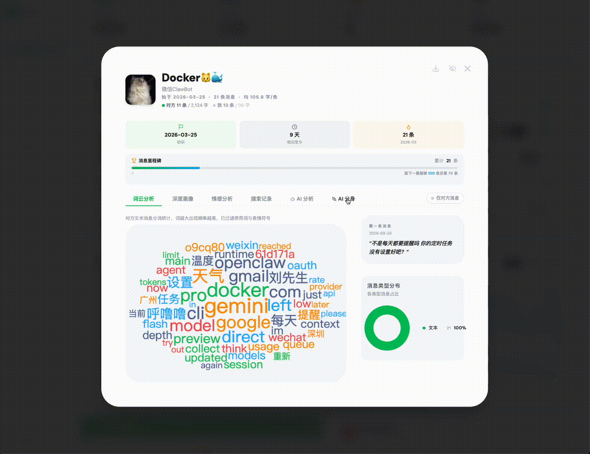](pics/1-AI分身.gif) | [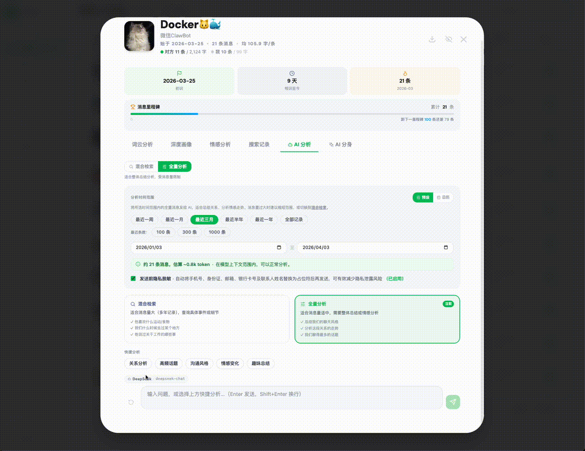](pics/2-AI分析.gif) |
| **AI 群聊** | **AI 首页** |
| [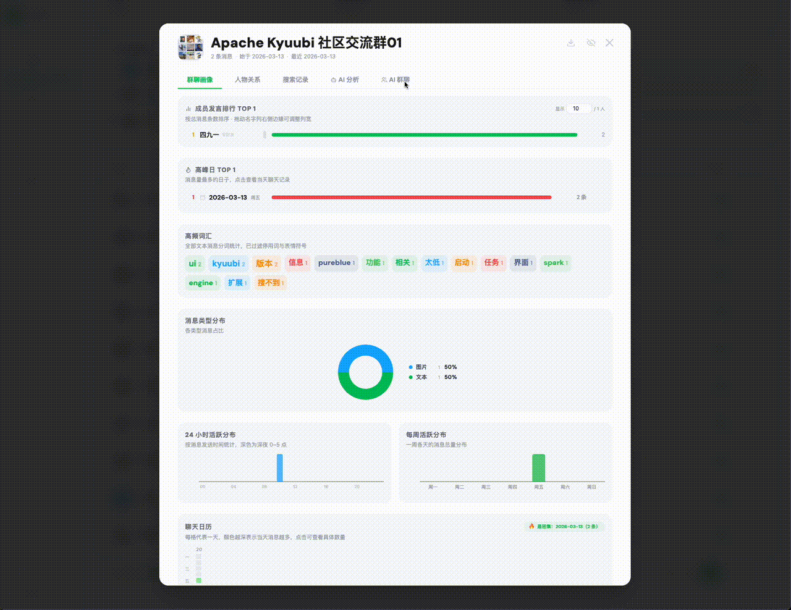](pics/3-AI群聊.gif) | [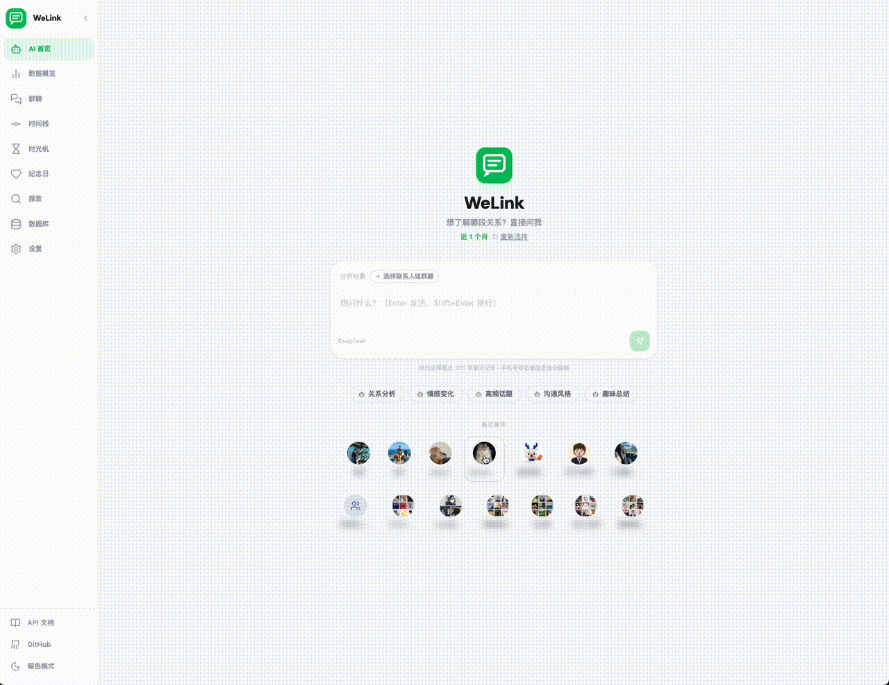](pics/4-AI首页.gif) |
| **快速入门引导** | **好友总览** |
| [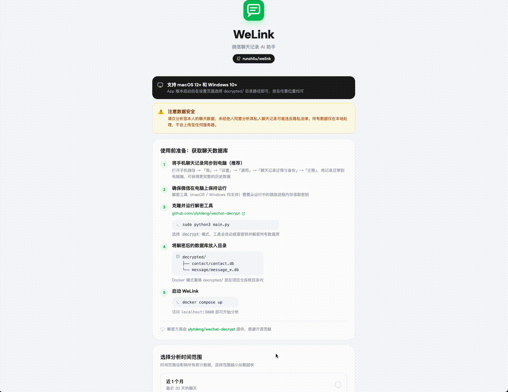](pics/5-快速入门引导.gif) | [](pics/6-好友总览.gif) |
| **好友深度画像** | **群聊画像** |
| [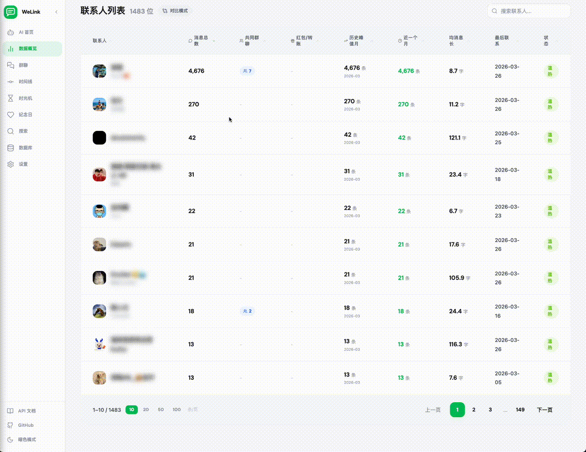](pics/7-好友深度画像.gif) | [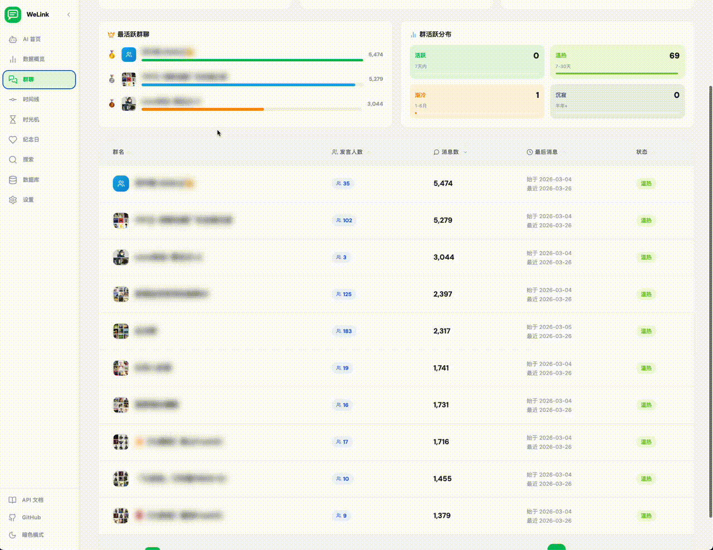](pics/8-群聊画像.gif) |
| **全局搜索** | **时间线** |
| [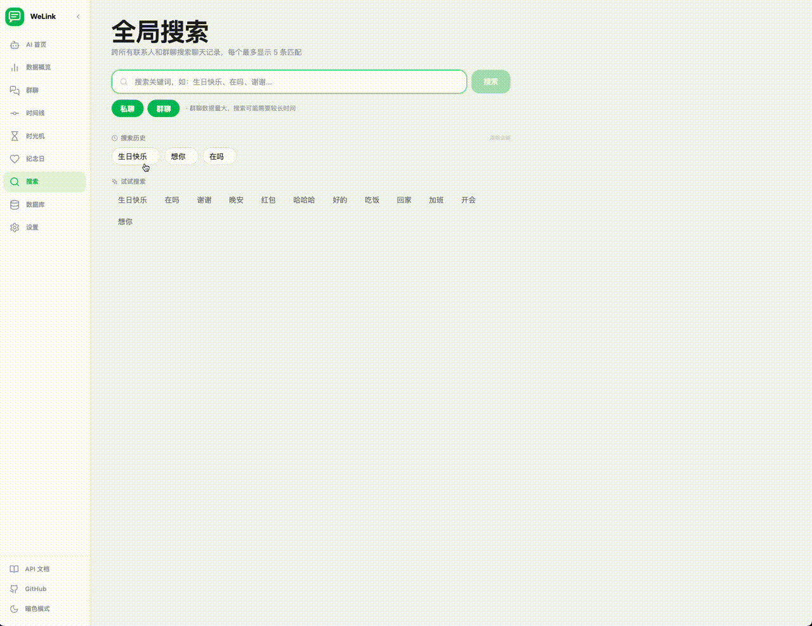](pics/9-全局搜索.gif) | [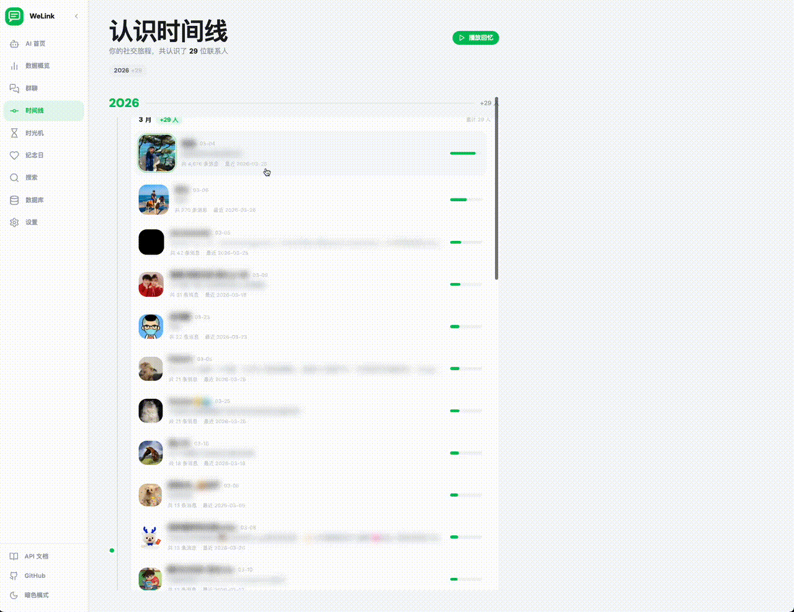](pics/10-时间线.gif) |
| **时光机** | **纪念日** |
| [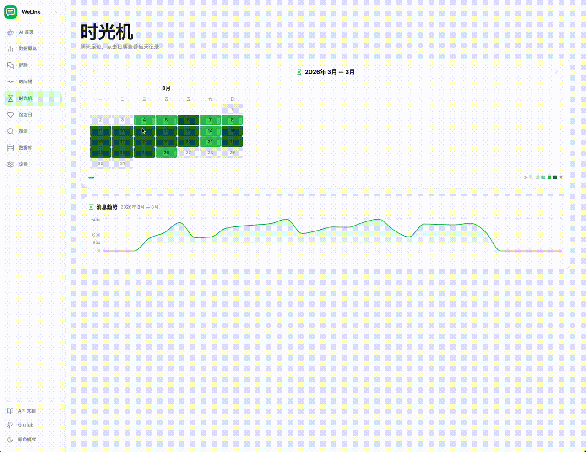](pics/11-时光机.gif) | [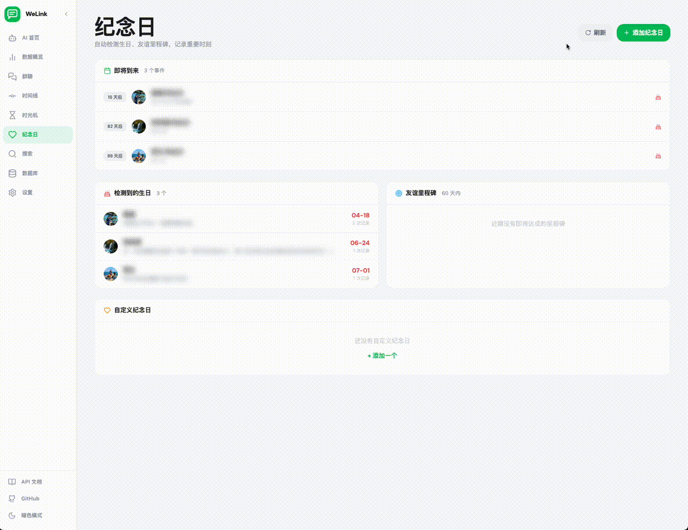](pics/12-纪念日.gif) |

---

## AI 分身（核心功能）

让 AI 学习任何联系人的聊天风格，**模拟和 TA 对话——像真的在和 TA 聊天一样**。

聊天记录是一个人最真实的语言印记。AI 分身从中学习 TA 的用词习惯、语气特征和表达方式，让你可以：

> 和已经**失去联系**的老友再聊一次——哪怕只是 AI 模拟的，也能找回当年的感觉
>
> 让**远在天堂的亲人**以 TA 熟悉的方式"回复"你——不是冰冷的机器，而是带着 TA 说话习惯的温暖文字
>
> 在做重要决定前，和**最信任的人的 AI 分身**聊聊——TA 会用 TA 的方式给你回应
>
> 或者纯粹好奇——**你最好的朋友**如果看到你发的这句话，会怎么回？

> [!NOTE]
> AI 分身旨在帮助用户回忆珍贵的人际关系。模拟结果由 AI 生成，不代表真人的真实想法。请善意使用，不要用于冒充他人身份或误导第三方。使用本功能即表示用户同意自行承担使用后果，项目作者不对因使用 AI 分身产生的任何直接或间接影响负责。

### 功能特点

- **风格学习**：从私聊记录 + 共同群聊中提取 TA 的文本消息（可选 100 / 300 / 1000 / 2000 / 全部条），AI 学习 TA 的用词、语气、断句、emoji 习惯
- **背景补充**：可填写 TA 的籍贯、职业、与你的关系等背景信息，让 AI 更准确地还原 TA 的人物特征
- **群聊联动**：自动列出与该联系人的共同群聊，可勾选要包含的群聊，只提取 TA 在群里的发言（按 sender_id 精确过滤），不会混入其他人的消息
- **Session 机制**：学习一次即缓存，后续多轮对话不再重复加载数据库，响应速度快
- **流式对话**：仿微信气泡界面，AI 回复逐字显示
- **对话续写**：AI 同时模拟你和 TA 继续聊天，像看一部关于你们的迷你剧

详细实现见 [ai-clone.md](docs/ai-clone.md)。

### AI 群聊模拟

让 AI 模拟群友继续聊天——按每个成员的**发言比例**和**说话风格**生成对话，你也可以随时加入。

- **风格画像**：自动分析每个成员的用词习惯、消息长度、表情使用、提问频率等特征
- **自定义配置**：可选参与成员、设定话题场景、调节聊天氛围（日常/激烈/深夜/搞笑/严肃）
- **多轮记忆**：模拟对话使用多轮对话机制，群友会回应你说的话，不会重复

详细说明见 [ai-group-sim.md](docs/ai-group-sim.md)。

### 跨联系人 AI 问答

不再局限于单个联系人——直接问关于**所有聊天记录**的问题，AI 自动搜索并汇总回答。

> 「谁跟我聊过旅行？」→ AI 搜索全部联系人，找到 3 人提到过旅行，汇总每人聊了什么
>
> 「去年国庆我都跟谁聊天了？」→ AI 查询 10/1-10/7 的日历数据，列出每天的聊天对象
>
> 「哪些朋友经常提到加班？」→ AI 搜索关键词，按匹配频次排列

技术原理：LLM Agent 模式——第一步 LLM 解析问题意图（提取关键词/时间范围），第二步自动调用搜索/日历 API 收集数据，第三步 LLM 基于真实数据生成回答。每次提问仅消耗 ~4000 token。

### 对话历史持久化

AI 首页的联系人分析和跨联系人问答的对话**自动保存到本地数据库**，支持：
- 历史记录列表，按时间排序，显示预览文字
- 点击加载历史对话，继续追问
- 刷新页面不丢失，下次打开仍可查看

### AI 洞察

对任意联系人生成三种深度分析（基于统计摘要 + 采样消息，低 token 消耗）：

- **关系报告**：关系发展阶段、沟通特点、关键数字、AI 感言
- **风格画像卡**：性格标签、口头禅、聊天习惯、趣味类比
- **AI 日记**：选择任意一天，AI 以第一人称写日记

### 自定义 Prompt 模板

所有 AI 功能的系统提示词（System Prompt）**完全透明、可自定义**：

- 每个 AI 功能旁边都有「查看 Prompt」按钮，可以看到当前使用的完整提示词
- 在设置页的「Prompt 模板」区块，可以编辑任意功能的 Prompt
- 支持变量：`{{name}}`（联系人名）、`{{today}}`（日期）、`{{rounds}}`（轮数）等
- 留空即恢复默认值，修改即时生效

---

## AI 分析

WeLink 内置完整的 AI 分析引擎，可对任意联系人、群聊或某一天的聊天记录发起对话式分析。

### 三种检索模式

| 模式 | 工作方式 | 适合场景 |
|------|---------|---------|
| **全量分析** | 将选定时间范围内的全部消息送入 LLM 上下文 | 深度关系分析、长期趋势总结 |
| **混合检索（RAG）** | FTS5 全文检索 + 语义向量检索，精准召回相关片段 | 查找特定事件、关键词检索 |
| **时光机 AI** | 跨所有对话的单日聚合分析 | 「某天发生了什么」式的日记回顾 |

### 记忆提炼

LLM 批量阅读聊天记录，自动提炼关键事实（人名、事件、情感节点）并持久化存储。后续对话中，AI 可以调用这些「长期记忆」，而不依赖每次重新加载全量消息。

### 支持的 LLM 提供商

| 提供商 | 说明 |
|--------|------|
| DeepSeek | DeepSeek-Chat，国产高性价比 |
| Kimi | Moonshot（月之暗面），支持超长上下文 |
| OpenAI | GPT-4o 等，标准 API |
| Claude | Anthropic Claude，通过原生 API 接入 |
| Gemini | Google Gemini，支持 OAuth 2.0 认证 |
| **Vertex AI** | **Google Cloud Vertex AI，原生支持**。认证方式：Service Account JSON → JWT → OAuth2 token（自动缓存刷新）。走 Vertex AI 的 OpenAI 兼容端点，支持所有 Gemini 模型 |
| **AWS Bedrock** | **原生支持**。认证方式：AWS SigV4 签名（手写实现，无 AWS SDK 依赖）。使用 Converse API（跨模型家族统一 API），支持 Claude / Llama / Mistral / Titan / Cohere 等所有 Bedrock 模型 |
| MiniMax | 国内版 + 国际版，支持 MiniMax-Text-01 等 |
| GLM | 智谱 AI，GLM-4 系列 |
| Grok | xAI Grok |
| Ollama | 本地部署，完全离线，数据不出本机 |
| 自定义 | 任意兼容 OpenAI 接口的模型服务 |

在设置页面填写提供商、Base URL、API Key 和模型名称即可。支持为 AI 对话和记忆提炼分别指定不同的模型。

> **Vertex AI 配置**：选择 `Google Vertex AI` provider → 粘贴完整的 Service Account JSON → 填写 GCP Project ID 和 Region → 选择模型（默认 `google/gemini-2.0-flash-001`）
>
> **Bedrock 配置**：选择 `AWS Bedrock` provider → 填写 AWS Access Key ID 和 Secret Access Key → 填写 Region → 填写 Model ID（如 `anthropic.claude-3-5-sonnet-20241022-v2:0`）

本地 Ollama 配置参考 [ollama-setup.md](docs/ollama-setup.md)，完整 AI 功能说明见 [ai-analysis.md](docs/ai-analysis.md)。

---

## MCP — 在 Claude Code 里直接提问

WeLink 内置 [MCP（Model Context Protocol）](https://modelcontextprotocol.io/) 服务器，让你在 **Claude Code（CLI）** 里用自然语言查询微信数据，无需打开浏览器。

完整配置见 [mcp-server/README.md](mcp-server/README.md)。

---

## 🔮 Skill 炼化 — 把聊天记录变成 AI 工具的能力包

**把聊天记录里的人际关系，直接炼化成 Claude Code / Codex / Cursor 等 AI 编程工具的 Skill 文件包。** 一次炼化，多处使用。

### 三种 Skill 类型

| 类型 | 输入 | 用途 |
|------|------|------|
| **contact** 联系人分身 | 和某联系人的全部聊天 | 让 AI 用 TA 的语气帮你写邮件、起草回复、预演对话 |
| **self** 我的写作风格 | 我发出去的所有消息 | 让 AI 用你自己的口吻写公众号、朋友圈、邮件，避免 AI 腔 |
| **group** 群聊智囊 | 某个群的集体聊天 | 回答「这个群会怎么说」，把群的集体知识/术语/氛围封装起来 |

### 六种输出格式（一键切换）

| 格式 | 目标工具 | 产物路径 |
|------|---------|---------|
| **claude-skill** | Claude Code Skills（目录式） | `~/.claude/skills/<name>/SKILL.md` + 附件 |
| **claude-agent** | Claude Code Subagent（单文件） | `~/.claude/agents/<name>.md`（带 frontmatter） |
| **codex** | OpenAI Codex CLI | 项目根 `AGENTS.md` |
| **opencode** | OpenCode Agent | `.opencode/agent/<name>.md` |
| **cursor** | Cursor Rules | `.cursor/rules/<name>.mdc`（支持 glob） |
| **generic** | 通用 Markdown | 工具无关，可粘贴到任何 AI 对话 |

### 炼化的内容
- **性格特征**：LLM 从真实对话里抽取的人物画像
- **说话风格**：句长、语气、用词偏好、标点习惯、emoji 使用
- **高频词与口头禅**：独特词汇和常用短语
- **常聊话题**：兴趣领域和专业方向
- **关系背景**：你和 TA 的关系推断（仅 contact 类型）
- **代表性原话**：5-8 条最能体现风格的消息片段（自动脱敏）
- **使用注意事项**：什么场景适合用、什么场景不适合

### 使用入口
- 联系人深度画像头部 → 紫色 Sparkles 图标按钮
- 群聊画像头部 → 紫色 Sparkles 图标按钮
- 洞察页「个人自画像」卡 → 「炼化我的 Skill」按钮

### Skills 管理

侧边栏新增「Skills」页面，集中管理所有已炼化的 Skill 包：

- **持久化存储**：每次炼化自动写入本地数据库（`ai_analysis.db` 的 `skills` 表），文件保存到 `~/.welink/skills/<id>/<filename>.zip`
- **后台异步执行**：炼化任务在 goroutine 中运行，**关闭弹窗、刷新页面都不会中断**
- **状态实时追踪**：等待中 / 炼化中 / 成功 / 失败（含错误原因），页面每 2s 自动刷新
- **搜索 + 筛选**：按目标名/文件名/模型名搜索，按类型（联系人/自画像/群聊/群成员）和状态筛选
- **表头排序**：按目标、类型、格式、炼化时间升降序排列
- **重新下载**：已成功的任务随时可以重新下载 zip 文件，不需要重新炼化
- **Mac App 路径显示**：炼化成功后显示保存到 `~/Downloads/` 的完整路径，可一键复制

### 隐私保护
- 炼化前手机号、邮箱、身份证号自动脱敏
- 整个过程只调用一次 LLM（约 5-15k token）
- 产物是本地 zip 文件，由你决定是否分享

---

## 💕 关系动态预测 — 谁在悄悄变冷，谁值得主动联系

WeLink 不止告诉你"现在关系多热"，而是**前瞻性**地判断每段关系的走向，并给出具体行动建议。

### 四档状态判定

扫描每个联系人最近 6 个月的消息节奏，对比**最近 3 月 vs 前 3 月**自动打档：

| 状态 | 判定条件 | 典型场景 |
|---|---|---|
| 🔥 **升温** | 最近 3 月消息增加 ≥50% | 新认识的人 / 深化中的关系 |
| ✅ **稳定** | 波动 ±30% 内 | 日常长期好友 |
| ❄️ **降温** | 最近 3 月消息量不到前期一半 | 开始疏远的信号 |
| 🚨 **濒危** | 前期 ≥10 条但 60 天没说过话 | 长期联系人快失联 |

### 多维度信号增强

简单的「消息减少了」可能是双方都忙，结合多维信号才能识别**到底是谁在疏远谁**：

- **主动占比趋势** — 过去你占 72%，现在降到 42% → 说明对方不再主动找你。差 ≥15pp 在 reason 里自动提示
- **响应时延趋势** — TA 去年 10 分钟回你，现在平均 8 小时 → 「TA 回复从 X 分钟变成 Y 小时」（变慢 ≥3× 且原本 ≤1h 才提）
- **连续冷却周数** — 基于客户端 localStorage 滚动 6 周快照，连续 ≥2 周处于 cooling/endangered 显示 🕐 红色徽章
- **最后消息相对时间** — 30 / 60 / 90 天阶梯色阶

reason 文案示例：
> 最近 3 个月消息减少 65%（120 → 42）；原本你更主动（72%），现在对方说得更多（58%）；TA 回复从 12 分钟变成 8 小时

### 两种入口

- **AI 首页「建议主动联系」卡片** — Top 5 cooling + endangered，直接可点打开联系人详情。每张卡支持「🪄 写开场白」和「不再推荐此人」。「今日不再提醒」按日期关闭
- **统计页「关系动态预测」section** — 4 tab 完整列表（濒危/降温/稳定/升温），每条带 12 月迷你折线，点 sparkline 弹大图 modal（12 月柱状图 + 峰值标注 + 主动占比双进度条 + 响应时延对比）

### 🪄 AI 开场白草稿（行动闭环）

对 cooling / endangered 联系人，点「写开场白」→ 取最近 40 条消息 + 相识年数 + 沉默天数 → LLM 写 4 条不同调性（关心 / 回忆 / 调侃 / 约见）的破冰草稿，一键复制粘到微信。

### 每周变化摘要

AI 首页顶部的小 banner，对比上次快照（≥5 天前）：「近 7 天变化：3 位关系降温 · 1 位回暖」。按 ISO 周关闭。

### 管理忽略名单

设置页加「关系预测 · 忽略名单」，首页点「不再推荐此人」后可在这里撤销。

---

## 📦 导出中心 — 数据一键搬家

把年度回顾、对话归档、AI 对话历史、记忆图谱四类内容，统一打包导出到 **8 种目标**：

**笔记 / 文档平台**

| 目标 | 实现方式 | 输出 |
|---|---|---|
| **Markdown** | 本地打包 | 单文件直下 / 多文件自动 .zip |
| **Notion** | `POST /v1/pages` + 自实现 Markdown→Blocks（标题/列表/引用/代码/表格） | 指定 Parent Page 下建新页 |
| **飞书文档** | `upload_all` → `import_tasks` 异步轮询 | 获得 docx URL |

**云盘 / 对象存储**

| 目标 | 协议 / 认证 | 覆盖服务 |
|---|---|---|
| **WebDAV** | HTTP PUT + Basic Auth + 递归 MKCOL | 坚果云 / Nextcloud / ownCloud / 群晖等 |
| **S3 兼容** | `minio-go` v7，支持 path-style / virtual-host 切换 | AWS S3 / Cloudflare R2 / 阿里云 OSS / 腾讯 COS / 七牛 / MinIO / Backblaze B2 |
| **Dropbox** | `files/upload` API + App Console 长期 Access Token（PAT 模式免 OAuth 回调） | Dropbox |
| **Google Drive** | 完整 OAuth 2.0 + multipart upload，refresh token 自动刷新 | Google Drive |
| **OneDrive** | Microsoft Identity Platform v2 OAuth + Graph API PUT | OneDrive（个人 / 工作账号） |

Token 配置与既有 LLM 配置一样支持脱敏占位符 `__HAS_KEY__`，保存后不会泄露明文。

**OAuth 类目标（Google Drive / OneDrive）使用流程**
1. 在目标平台的开发者控制台创建 OAuth Client，授权回调 URI 填 `http(s)://<你的 WeLink 地址>/api/export/oauth/<gdrive|onedrive>/callback`
2. 把 Client ID / Secret 粘到导出中心配置卡 → 保存 → 点「授权」→ 浏览器跳转完成授权 → 自动回传 token
3. 之后每次导出自动 refresh，token 过期不用管

---

## 🗄️ 数据库管理 — 分析师工作台

SQLite 数据直接暴露给懂 SQL 的用户，配 **4 件套** 工具：

- **SQL 模板**：10 个预置常用查询（消息排行、联系人列表、群聊列表、AI 对话历史、Skill 记录、记忆提炼等），点一下填入编辑器 + 自动选数据库
- **结果一键画图**：结果 ≥2 列时点「图表」，第一列 X 轴 / 第一个数字列 Y 轴自动出柱状/折线（日期格式走折线）
- **磁盘占用环形饼图**：每个 DB 文件占比 + Tooltip + 彩色图例
- **SQL 历史 + 收藏**：自动记录最近 20 条执行历史；点「收藏」起名保存常用 SQL，列表置顶展示

### 💬 自然语言查数据（中文问 AI 写 SQL）

在面板里输入中文问题，例如：

> 「我和老婆的第一条消息是什么时候」
> 「今年跟我妈聊了多少条消息」

LLM 会：
1. 读取自动生成的 WCDB schema 摘要
2. 输出 `{db, sql, explain}` JSON（严格限制 SELECT/PRAGMA only + LIMIT 50）
3. 后端执行并返回结果表 / 自动画图

**跨库联系人消息**（`mode=contact_messages`）：按备注模糊查 contact.db → md5 计算 `Chat_xxx` 表名 → 遍历 message_N.db 找到有该表的 DB 执行 SQL。"我和 XX 的..." 这类跨库问题现在也能直接回答。

结果表支持**一键 CSV 下载**。

---

## 数据分析功能

**好友分析**
- 消息总量排行、关系热度变化（历史峰值 vs. 近一个月）
- 聊天趋势折线图、24 小时活跃分布、聊天日历热力图
- 词云分析、情感趋势曲线（按月，可切换仅对方/双方）
- 撤回次数、红包/转账次数（分开统计，含时间线记录）、主动发起对话比例等社交特征
- 共同群聊数
- **聊天里程碑**：初识日期 + 第一条消息预览、消息量门槛（100/500/1K/5K…）、最火月份、认识天数
- **深夜守护统计**：深夜消息占比、最活跃时段、深夜密友 Top 3
- **渐行渐远的人**：近一月消息量比历史峰值下降超过 80% 的联系人预警
- **弹窗全屏模式**：私聊和群聊弹窗支持全屏查看
- **刷新保持**：联系人/群聊弹窗状态写入 URL hash，刷新页面自动恢复

**时光机**
- 以 3 个月为单位的可滑动日历热力图，覆盖全部历史
- 点击任意日期查看当天私聊 + 群聊记录，或直接发起 AI 分析
- **「去年今天」回忆横幅**：自动检测 1-5 年前今天的聊天记录，点击查看

**群聊分析 + 小团体检测 + 对比**
- 成员发言排行、活跃时间分布、高频词
- 人物关系力导向图：互动频率可视化，支持拖拽和悬停高亮
- **小团体检测**：Louvain 社区检测 + 模块度 Q 兜底（Q<0.3 时不强行凑圈），基于真实 `refermsg/chatusr` 引用信号而非时间窗
- **潜水成员检测**：显示每个成员的最后发言时间（>180天红色 / >30天橙色），支持按消息数/最后发言/名字排序，快捷筛选 Top 3/10/50/全部
- **💕 群内「我的 CP」**：扫描引用消息（lt=49 `<refermsg><chatusr>`），列出跟我双向引用互动最多的成员 Top 3，挂在群画像顶部。比单纯 @ 或消息数更能识别"隐形聊友"
- **🎬 群聊回放**：按最近 N 条 / 按日期范围加载群消息，6 档倍速（实时 ~ 100×）真实时间间隔回放，连续同发言人合并头像 + 日期分割线
- **群聊搜索**：支持按发言人筛选，结果可导出 TXT/CSV
- **群聊活跃度对比**：同时选中多个群对比消息量、成员数、日均消息、人均消息

**群聊四件套 — 这个群的指纹**
- **⚡ 群号称卡**（群的 MBTI）：基于 hourly_dist / weekly_dist / type_dist / member_rank 规则派生 2-4 条标签 —— 深夜话唠 / 工作日正午群 / 晚八点饭后群 / 周末活跃 / 工作日只上班群 / 表情包战场 / 图包王国 / 链接集散地 / 语音派对 / 红包雨 / 消息洪流 / 静默多数派 / 潜水员联盟 等。零 LLM 零后端
- **🕐 时钟指纹**：7×24 小热图徽章，log 压缩着色，一眼识别「工作群作息 / 深夜局 / 周末亲友群」不同性格
- **📊 群影响力指数**：我发言后 30 分钟内有异发言者回应的比例 vs 群整体基线，Score = min(myRate/baseRate, 2) × 50。看你在哪个群更"有号召力"
- **📖 AI 群年报**：Spotify Wrapped 风格分页卡片 —— 年度概览 / 话痨榜 Top 3 / AI 精选 3 条金句（原文引用）/ 月度趋势柱状图 / 60-100 字 AI 叙事。每群每年可生成

**群聊列表四维信息**
- **我的参与度**：在每行副标展示「我 #N · X%」（在成员发言排行里的位置 + 消息占比）
- **近期活跃度**：旁边一个「30天 N 条」区分"已死"和"活跃"群
- **活跃趋势箭头**：最近 3 月 vs 前 3 月百分比变化，↑12% 绿 / ↓35% 红
- **我最后发言时间**：不同于群最后消息 —— 显示我自己在这个群潜水了多久

**回复节奏分析（联系人深度画像）**
- 双向对比我 / 对方的回复速度（中位数、均值、秒回次数、慢回次数）
- 按 24 小时分时段的平均回复速度柱状图
- 消息间隔分布直方图：10秒 / 1分钟 / 10分钟 / 1小时 / 6小时 / 1天
- 聊天密度曲线：按月统计消息间隔均值，自动判断升温 / 降温 / 平稳趋势

**谁最像谁 — 联系人相似度分析**
- 基于消息类型分布、平均消息长度、表情偏好、互动方式等 18 维特征向量
- 余弦相似度算法计算所有联系人间的聊天风格相似度
- 展示共同高频词，发现说话最像的两个人

**红包 / 转账全局总览**
- 全局 KPI：红包总数、转账总数、我发出、我收到
- 月度收发趋势柱状图
- 联系人红包转账排行，细分四个方向（发红包 / 收红包 / 发转账 / 收转账）

**个人自画像**
- 汇总所有「我」方向的消息数据
- 发出消息总数、平均字数、最活跃时段、联系过的人数
- 最爱发消息的星期、最常联系的人
- 24 小时个人发送分布

**每日社交广度**
- 每天联系了多少个不同的人（不是消息数）
- 年度曲线 + 日均 / 最广日统计，看到"社牛日"和"闭关日"

**共同社交圈**
- 选择两个联系人，基于共同所在群聊推测他们的共同朋友圈
- 列出共同群聊（小群优先）和推测的共同好友
- 标记每个共同好友出现的群数，多群共现 = 关系更紧密

**链接收藏夹**
- 自动扫描所有聊天中发过 / 收过的链接，按域名聚合
- 支持搜索、按域名筛选、导出 CSV
- 当作"个人书签库" — 那些在微信里分享过的好文章再也不会丢

**消息撤回排行**
- 基于已有的撤回数据做"谁最爱撤回消息"排行 + 撤回率

**词云交互**
- 悬浮显示词频 tooltip，点击固定详情卡（次数、排名、相对频率条）

**全局统计**
- 关系热度分布五档：活跃 / 温热 / 渐冷 / 沉寂 / 零消息
- 月度趋势、深夜聊天排行榜

**纪念日**
- 自动检测生日（扫描"生日快乐"等关键词，按年份去重）
- 友谊里程碑提醒（认识 100/365/1000/... 天）
- 支持自定义纪念日（标题、日期、是否每年重复）
- **AI 首页「今天的纪念日」banner**：客户端聚合 4 类当天命中（首条消息 MM-DD 对应的整周年 / 检测生日 / 0 天里程碑 / 自定义），Hero 上方小卡，单条点击直接开联系人，多条跳纪念日 tab，按日期关闭

**全局搜索增强**
- 跨联系人全局关键词搜索（热门推荐词 + 搜索历史持久化）
- 时间范围筛选（预设一周/一月/三月/一年 + 自定义日期）
- 搜索结果排序（匹配数 / 最新时间 / 联系人消息量）
- 统计摘要条 + Top 5 迷你柱状图
- 即输即搜（2 字以上 500ms debounce 自动搜索）
- 空结果建议（换关键词 / 清除时间筛选）

**链接收藏夹增强**
- 来源筛选（全部 / 私聊 / 群聊）+ 方向筛选（我发出 / 我收到）
- 时间范围筛选 + 联系人快捷选择（Top 30 按链接数排序）

**其他**
- 认识时间线（垂直河流式，按年月展开，支持播放回忆动画）
- 联系人对比（勾选 2-6 人，雷达图 + 柱状图 + 数据明细）
- 社交体检报告（健康指数 + 洞察，支持分享为图片）
- 全局字号调节（设置页 12-22px 滑块，Docker/macOS/Windows 全平台支持）
- 时间范围筛选（预设 + 自定义）
- 隐私屏蔽（联系人 / 群聊，仅本地生效）

---

## 使用技巧

完整说明见 [docs/ux.md](docs/ux.md)，高频用到的几项：

| 功能 | 快捷键 / 入口 | 做什么 |
|---|---|---|
| **命令面板** | `⌘K` / `Ctrl+K` | 搜索联系人 / 群聊 / AI 对话历史（支持拼音首字母，输入 `zw` 能搜到「张伟」）；触发备份、诊断、刷新索引、切主题、反馈问题等动作；空查询显示最近打开 |
| **Tab 快捷切换** | `⌘1` .. `⌘9` | 首页 / 统计 / 联系人 / 群聊 / 搜索 / 时间线 / 日历 / Skills / 设置 |
| **一键诊断** | 设置 → 诊断 | 数据目录健康 / 索引状态 / LLM 探活 / 磁盘占用；支持一键复制为 Markdown 贴 issue |
| **AI 数据备份 / 恢复** | 设置 → AI 数据备份 | `VACUUM INTO` 自洽快照；App 模式写下载目录 + 可在 Finder 定位，Docker 模式触发浏览器下载 |
| **多账号切换** | 设置 → 数据目录·多账号切换 | 把多个 `decrypted/` 作为 profile 保存，热替换无需重启 |
| **AI 对话全局搜索** | `⌘K` 输入关键词 | 跨所有联系人 / 时光机 / AI 首页的对话里做子串搜索，命中展示上下文片段 |
| **索引进度 + 取消** | 初始化屏幕 | 真实进度条 + ETA + 当前处理联系人；中途可取消 |
| **导出目录可配置** | 设置 → 导出图片保存位置 | 默认 `~/Downloads`，可改成任意 Home 下目录；保存后 toast 里有「在 Finder 中显示」 |
| **启动自动探测** | — | 找不到数据目录时，Docker / App 各自展示针对性引导；只读盘会给出警告 |
| **一键反馈问题** | 设置 → 诊断 → 反馈问题，或 ⌘K「反馈」 | 自动附带诊断报告 + 环境信息；没 GitHub 账号可复制 md / 下载文件贴到任意地方 |
| **界面崩溃自救** | — | ErrorBoundary 接住异常，不会白屏；可一键带 stack 反馈 |
| **设置页内搜索** | 设置页顶部搜索框 | 输入"下载"/"LLM" 等关键词过滤 section |
| **自动检查新版本** | 启动 5s 后后台 GitHub API 轮询 | 有新版本弹 Release Notes Modal 展示 changelog；「我先用着」记住版本不再烦人 |
| **LLM 用量统计** | 设置 → LLM 用量 | 累计字符 / 估算 tokens，按 provider 分组 |
| **有趣发现** | 统计页底部 | 字数换算 / 最话痨一天 / 互动档位 / 陪伴时长 / 微信 MBTI / 首次相遇 / 沉默最久 / Ghost 月 / 表情包浓度 / 独白指数 / 最像我的朋友 / 我的人设 / 秘语雷达 / 词语年鉴 / 失眠陪聊榜 |
| **关系动态预测** | AI 首页 + 统计页底部 | 4 档趋势 + 建议主动联系 Top 5 + AI 开场白草稿 + 12 月折线大图 |
| **导出中心** | 侧边栏「导出」 | 年度回顾 / 对话归档 / AI 历史 / 记忆图谱 × 8 种目标（Markdown / Notion / 飞书 / WebDAV / S3 / Dropbox / Google Drive / OneDrive） |
| **数据库查询** | 侧边栏「数据库」 | SQL 模板 + 自然语言问 AI 写 SQL + 结果画图 + SQL 历史收藏 |
| **真实头像** | 所有聊天回放 / 日聊面板 / 搜索上下文 | 对方和「我」都显示真实头像，无头像时降级彩色首字母圆圈 |

---

## 快速开始

### 第一步：解密微信数据库

把手机聊天记录同步到电脑后（微信 → 设置 → 通用 → 聊天记录迁移），使用 [wechat-decrypt](https://github.com/ylytdeng/wechat-decrypt) 解密：

```bash
git clone https://github.com/ylytdeng/wechat-decrypt
cd wechat-decrypt
sudo python3 main.py   # 选择 decrypt 模式
```

解密后生成 `decrypted/` 目录（含 `contact/contact.db` 和 `message/message_N.db`）。

### 第二步：启动 WeLink

**Docker 模式**（将 `decrypted/` 放在仓库根目录内）：

```bash
cd welink
docker compose up
```

访问 [localhost:3418](http://localhost:3418) 开始使用。

> 完整 Docker 部署指南（环境变量 / Volume / 反代 HTTPS / 升级 / 多 profile / K8s 等）见 [docs/docker.md](docs/docker.md)。

**macOS / Windows App**（无需 Docker）：前往 [GitHub Releases](https://github.com/runzhliu/welink/releases) 下载，启动后在设置页选择 `decrypted/` 目录即可。

> **端口说明**：详见下方[端口与自定义](#端口与自定义)章节。

### 没有数据？先试试 Demo

```bash
docker compose -f docker-compose.demo.yml up
```

或直接访问 **[https://demo.welink.click](https://demo.welink.click)**。

> Demo 数据以**阿森纳 2025/26 赛季一线队球员与教练组**为联系人，消息内容充满更衣室气息。**COYG！** 🔴⚪

---

## macOS App 安装说明

> **系统要求：macOS 12（Monterey）及以上**

1. 前往 [GitHub Releases](https://github.com/runzhliu/welink/releases) 下载最新 `WeLink.dmg`
2. 拖入 `/Applications`，双击运行

> **提示「无法打开」？** 右键 → 「打开」→ 再次点击「打开」。若仍无效：`xattr -cr /Applications/WeLink.app`

完整指南（配置路径 / 端口自定义 / 升级 / 多 profile / FAQ）见 [docs/install-macos.md](docs/install-macos.md)。从源码构建：`make dmg`。

## Windows App 安装说明

> **系统要求：Windows 10 1903 及以上**

1. 下载 `WeLink-windows-amd64.zip`，解压后双击 `WeLink.exe`
2. 如提示缺少 WebView2，从 [Microsoft 官网](https://developer.microsoft.com/microsoft-edge/webview2/) 安装 Evergreen Bootstrapper
3. SmartScreen 拦截时点「更多信息」→「仍要运行」

完整指南（`%APPDATA%\WeLink` 配置路径 / 端口自定义 / 升级 / 多 profile / FAQ）见 [docs/install-windows.md](docs/install-windows.md)。从源码构建：`make exe`。

---

## 端口与自定义

WeLink 启动时会占用以下端口：

| 运行方式 | 后端端口 | 前端端口 | 说明 |
|----------|---------|---------|------|
| **macOS / Windows App** | `8080` | — | 内置 WebView，后端直接监听 8080，无需额外端口 |
| **Docker Compose** | `8080`（容器内） | `3418` → 容器 `80` | 浏览器访问 `localhost:3418` |
| **本地开发** | `8080` | `3418` | 后端 `go run .`，前端 `npm run dev` |

### 自定义端口

**macOS / Windows App**：在设置页修改端口，或编辑 `preferences.json`：
```json
{ "port": "9090" }
```
也可以通过环境变量覆盖：
```bash
PORT=9090 ./WeLink
```

**Docker Compose**：修改 `docker-compose.yml` 的端口映射：
```yaml
ports:
  - "5000:80"  # 改为 5000
```

**本地开发**：
- 后端端口：编辑 `config.yaml` 的 `server.port`，或 `PORT=9090 go run .`
- 前端端口：编辑 `frontend/vite.config.ts` 的 `server.port`

---

## 推荐运行配置

| 数据规模 | 消息量 | 推荐内存 | 首次索引时间 |
|----------|--------|----------|-------------|
| 轻量     | < 50 万条  | 2 GB | < 30 秒 |
| 中等     | 50–200 万条 | 4 GB | 1–3 分钟 |
| 重度     | 200 万条以上 | 8 GB+ | 3–10 分钟 |

首次使用建议先选「近 6 个月」体验，确认无误后再切换到「全部数据」。

---

## 技术栈

| 层次 | 技术 |
|------|------|
| 后端 | Go + Gin |
| 前端 | React 18 + TypeScript + Tailwind CSS |
| 数据库 | SQLite（modernc，纯 Go，无 CGO） |
| 全文检索 | SQLite FTS5 |
| 向量检索 | 余弦相似度（纯 Go，无外部依赖） |
| AI / LLM | OpenAI / Ollama / Gemini / 自定义（兼容 OpenAI 接口） |
| 中文分词 | go-ego/gse |
| 部署 | Docker Compose |

API 文档：启动后访问 [localhost:3418/swagger/](http://localhost:3418/swagger/)。更多技术细节见 [docs/](docs/README.md)。

---

## 数据安全

所有数据仅在本地处理，不会上传至任何服务器。请仅分析自己的聊天记录。

## 感谢

本项目依赖 [ylytdeng/wechat-decrypt](https://github.com/ylytdeng/wechat-decrypt) 实现微信数据库解密。微信数据库使用 SQLCipher 加密，该项目从进程内存中提取密钥，是 WeLink 的基础。

## 开源协议

本项目采用 [GNU Affero General Public License v3.0 (AGPL-3.0)](LICENSE) 协议。

## Star History

[](https://star-history.com/#runzhliu/welink&Date)
